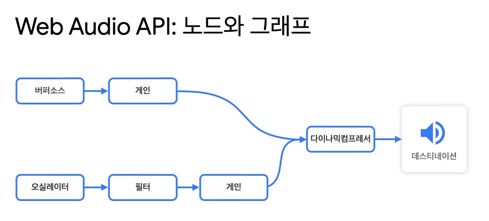

# simple-drum-machine
## [Web Audio API를 사용하여 간단한 드럼머신 만들기](https://www.youtube.com/watch?v=MY8LZ49D76c)  
유튜브에 최홍찬 구글 크롬 웹 오디어 테크리더분께서 한글날을 기념으로 올려두신 영상을 참조하여 예제 프로젝트를 구성했습니다.

## Web Audio API
Web Audio API는 일반적인 AudioElement로 구현할 수 없는 복잡하고 다양한 오디오 기능을 구현하기 위해 사용된다.
- 게임
- 화상회의
- 음악교육
- 음악제작
- 입체음향

Web Audio API는 아래와 같은 노드 구성으로 사용된다.

예제에서는 위와 같은 오디오 노드 구성으로 간단한 드럼머신을 만들었다.